<div align="center">


<p>
<a href="https://pypi.org/project/hotato/"></a>
<a href="https://pypistats.org/packages/hotato"></a>
<a href="https://pypi.org/project/hotato/"></a>
<a href="https://github.com/attenlabs/hotato/actions/workflows/tests.yml"></a>
<a href="https://github.com/attenlabs/hotato/blob/main/LICENSE"></a></p>
<!-- Add a stars badge (shields.io github/stars/attenlabs/hotato) here once the repo reaches ~25 stars; below that it advertises the low number. -->

# hotato

**Local-first testing and observability for AI agents.**

Your evals are green. Your agent still ships bugs they can't see: talk-over, dead air, a tool it swore it ran. hotato catches them on your machine and gates CI so they stay fixed.



**[hotato.dev](https://hotato.dev)**

</div>

Free, open-source, and deterministic: the same call scores the same way every run, so you can gate a build on it. Your traces and prompts never leave your machine, and there's no per-seat or per-event bill as you scale.

**Your first catch in seconds. One command, no account:**

```console
$ uvx hotato start --demo
Conversation failed: Agent did not yield; measured talk-over was 2.66 s.
    talk-over     2.66s   the agent kept talking while the caller held the floor
```

That transcript passed every text eval. The timing did not. hotato pins the catch as a CI contract that reproduces byte for byte, so a fixed bug stays fixed. It measures timing and say-do, not intent.

If hotato caught something your evals missed, a [star](https://github.com/attenlabs/hotato) helps other teams find it.

## The loop

Turn production failures into portable tests, run candidate releases against them, and carry evidence with every release. Five steps, one command each, nothing leaves your machine.

| | | |
| :-- | :-- | :-- |
| **Observe** | traces, tokens, cost, and latency, from the OTel spans you already emit | `hotato observe report traces/` |
| **Catch** | deterministic scoring finds what text evals miss: timing, say-do, policy | `hotato investigate call.wav` |
| **Pin** | your label turns the catch into a portable, content-addressed contract | `hotato investigate label STATE#1 --expect yield` |
| **Test** | simulate, stress, and drive candidates against everything you pinned | `hotato gauntlet` |
| **Prove** | every evidence lane composed into one fail-closed, content-addressed proof, in CI | `hotato prove --contracts contracts/` |

Deterministic. Byte-reproducible. Free, MIT. Agent-native over MCP. Every verdict carries its evidence across five dimensions (outcome, policy, conversation, speech, reliability), and production feeds the next loop: `hotato production export-regression` turns a live session back into a test.

The whole loop, command by command: [`docs/LIFECYCLE.md`](docs/LIFECYCLE.md).

## Why it is different

Same loop a hosted platform runs. Three things it cannot offer.

| | hotato | Hosted platforms |
| :-- | :-- | :-- |
| Observe, catch, pin, test, prove | yes | yes |
| Price at scale | free, MIT, any volume | metered per seat and per event |
| Verdicts | byte-for-byte reproducible, gate a build | model-judge lanes vary run to run |
| Your traces and prompts | stay on your machine | live on their servers |
| Runs in CI, offline | yes | needs their service |

Full comparison: [`docs/COMPARE.md`](docs/COMPARE.md)

## From a bad call to a proof

One recording in. The pinned failure becomes a gate that stays red until the agent stops failing that call, and every gate you have composes into one receipt whose headline states exactly what it establishes:

```console
$ hotato investigate ./call.wav
  most likely failure: [1] the agent talked over the caller for 2.66s
  next: hotato investigate label '.hotato/investigate-state.json#1' --expect yield

$ hotato investigate label '.hotato/investigate-state.json#1' --expect yield
  created hotato contract: call-8s-yield

$ hotato prove --contracts contracts/
Captured Evidence: FAIL
  A lane failed or regressed; see the table.
  contracts  fail  contracts=1 passed=0 failed=1
content_id: sha256:c907143d711a84ae...
```

`hotato prove` composes every lane you have (contracts, suites, before/after batteries, the stress suite) into one fail-closed, content-addressed receipt: pass only when every lane passed, and "could not tell" is never green. The headline is the **claim scope** the evidence supports, never more: contracts alone re-measure stored evidence (**Captured Evidence**), a suite establishes a **Test Suite** ran, and a before/after run reaches **Candidate Revision** only when you bind the candidate identity (`--candidate-config-hash`, `--provider`).

## Quickstart

```bash
# 1. catch a failure on two bundled calls (no account; exits 0)
uvx hotato start --demo
# 2. score your own recording (or a transcript: --transcript t.json)
hotato investigate ./call.wav
# 3. pin the caught moment as a regression contract
hotato investigate label '.hotato/investigate-state.json#1' --expect yield
# 4. compose every gate into one proof, scoped to what it establishes
hotato prove --contracts contracts/
```

Keep it with `pipx install hotato`, drive it over MCP with `uvx --from "hotato[mcp]" hotato-mcp`, or walk the path in [`docs/GETTING-STARTED.md`](docs/GETTING-STARTED.md).

## Wire it into CI

The step's exit code **is** the verdict: `0` pass, `1` fail, `2` refuse.

```yaml
# .github/workflows/voice-qa.yml
on: [pull_request]
jobs:
  hotato:
    runs-on: ubuntu-latest
    steps:
      - uses: actions/checkout@v4
      - uses: attenlabs/hotato@v1.15.1
        with:
          contracts: contracts/
          hotato-version: 1.15.1
```

Copy-paste workflow with a commit-SHA pin: [`docs/CI.md`](docs/CI.md).

## Feed it what you already have

Every onramp feeds the same offline scoring and the same `0` / `1` / `2` exit contract.

```bash
hotato pull --stack vapi --limit 10          # your stack's recorded calls
hotato trace ingest --otel traces.jsonl      # the OTel spans you already log
hotato simulate demo.scenario.json --out ./sim   # scripted fixtures, no production audio
```

Details: [`docs/CONNECT.md`](docs/CONNECT.md) &#183; [`docs/TRACE.md`](docs/TRACE.md) &#183; [`docs/SIMULATE.md`](docs/SIMULATE.md)

## Point your agent at it

Point Claude Code, Cursor, or any coding agent at this repo: it reads [`AGENTS.md`](AGENTS.md) and runs the loop end to end, offline, no key. The MCP server exposes the scorer plus read/verify/propose tools over local stdio ([`docs/MCP.md`](docs/MCP.md)).

## Nothing leaves your machine

hotato runs offline, on the machine that invokes it. The core is stdlib-only Python: no account, no key, no network call of its own. Your traces, prompts, and audio stay local, and the local-judge lane is opt-in and quality-gated, separate from the deterministic core.

## Specifications

| Property | Value |
| :-- | :-- |
| Footprint | ~10 MiB installed, 0 runtime dependencies (stdlib-only) |
| Reproducibility | byte-for-byte, content-addressed contract |
| Exit contract | `0` pass &#183; `1` fail &#183; `2` refuse |
| Release integrity | OIDC Trusted Publishing + build-provenance attested |
| Runtime | offline, off the production data path |

<details>
<summary><b>Verify the measurement yourself</b></summary>

```bash
PYTHONPATH=src python3 -m hotato.benchmark \
  --scenarios corpus/real/scenarios --audio corpus/real/audio
```

On 13 recorded AMI Meeting Corpus clips, the median error between measured caller-onset and the human word-alignment label is **20 ms**. Provenance: [`corpus/real/README.md`](corpus/real) &#183; method: [`METHODOLOGY.md`](METHODOLOGY.md).

Timing is measurable only when the two voices arrive on separate channels; a mono or mixed export is marked **NOT SCORABLE** and refused (`hotato trust --stereo call.wav`).

</details>

## Contribute

Issues and PRs welcome: [`CONTRIBUTING.md`](CONTRIBUTING.md) &#183; [`SECURITY.md`](SECURITY.md) &#183; [`CHANGELOG`](CHANGELOG.md) &#183; [`docs/`](docs/)

## Star history

<a href="https://star-history.com/#attenlabs/hotato&Date"></a>

## License

MIT ([`LICENSE`](LICENSE))

<div align="center">
<sub>If hotato caught something your evals missed, a <a href="https://github.com/attenlabs/hotato">star</a> helps other teams find it.</sub>
<br>
<sub>Know when to pass it on.</sub>
</div>

mcp-name: io.github.attenlabs/hotato
