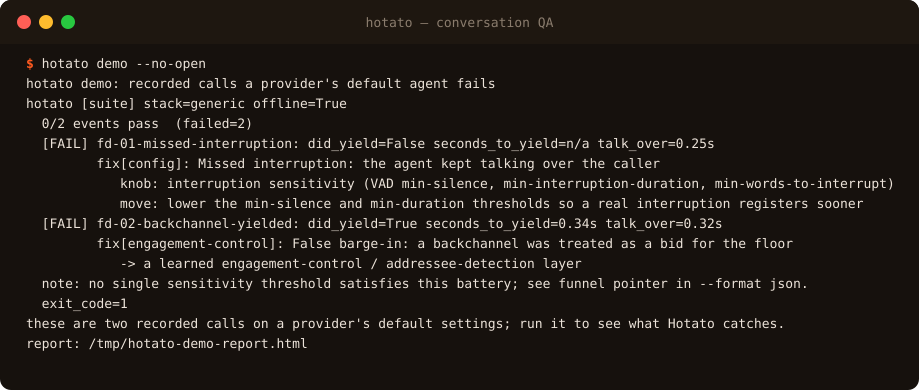

<div align="center">


</div>

**hotato** is self-hosted conversation QA for voice agents. The name is hot potato.

A turn is a hot potato: hold it a beat too long and you have dropped it. Give
hotato both channels of a recorded call and it measures the timing between the
two voices: how fast the agent yielded when the caller took the floor, how many
seconds they talked over each other, and whether it stopped for a backchannel it
should have talked through. It measures timing, not intent, so a mono or bad
export is marked NOT SCORABLE instead of scored. Each catch locks into a CI
contract, so a regression fails the build (exit 1) instead of shipping. MIT,
offline, no account.

<p align="center">
  
</p>

## Install

```bash
uvx hotato demo --fail                 # zero-install, runs the bundled battery
pipx install hotato                    # keep it in a project
uvx --from "hotato[mcp]" hotato-mcp    # drive it from a coding agent over MCP, local stdio
```

## Five dimensions

- **Outcome**: job done, on tool-call and state evidence.
- **Policy**: required disclosures, PII handling.
- **Conversation**: did the agent yield when the caller took the floor, and how fast.
- **Speech**: response latency and turn timing.
- **Reliability**: pass@1 / pass@k / pass^k with a Wilson interval.

A call comes in two channels (caller on one, agent on the other). A mono or bad export is marked NOT SCORABLE, so a verdict measures timing, not intent.

## License

MIT ([`LICENSE`](LICENSE))

mcp-name: io.github.attenlabs/hotato
