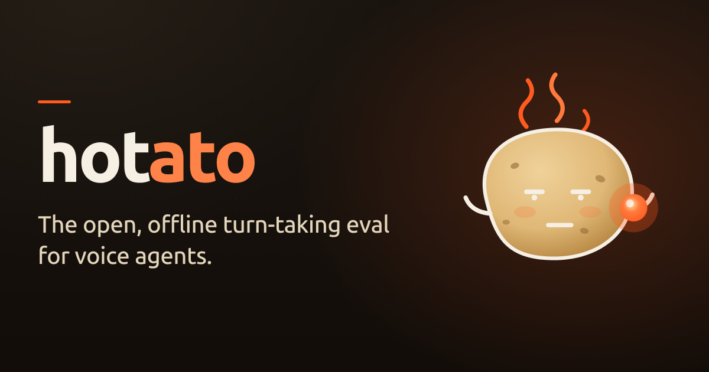

<p align="center">
  <a href="https://hotato.dev">
    
  </a>
</p>

<h1 align="center">
   hotato
</h1>

<p align="center"><b>An open, offline tool that scores voice-agent turn-taking from a call recording.</b></p>

<p align="center">
  <a href="LICENSE"></a>
  
  
  
  <a href="https://hotato.dev"></a>
</p>

<p align="center">
  Built for anyone shipping voice agents on LiveKit, Pipecat, Vapi, Retell, or Twilio.<br>
  Runs on your machine, so your call audio stays with you.
</p>

Point it at one of your own call recordings. It shows where your agent talked over
the caller, or missed a real interruption, and points each failure at the config
knob that fixes it. Every result is reproducible timing you can verify frame by
frame and gate a PR on.

## Quickstart (60 seconds)

Already have a two-channel WAV (caller on channel 0, agent on channel 1)?

```bash
uvx hotato run --stereo your_call.wav --expect yield
```

Or run the bundled self-test, offline, with zero setup:

```bash
uvx hotato run --suite barge-in
```

```text
$ uvx hotato run --suite barge-in
hotato [suite] stack=generic offline=True
  8/8 events pass  (failed=0)
  [PASS] 01-hard-interruption: did_yield=True seconds_to_yield=0.50s talk_over=0.50s
  [PASS] 02-backchannel-mhm: did_yield=False seconds_to_yield=- talk_over=1.57s
  [PASS] 03-filler-start: did_yield=True seconds_to_yield=0.65s talk_over=0.56s
  [PASS] 04-correction: did_yield=True seconds_to_yield=0.50s talk_over=0.50s
  [PASS] 05-telephony-8khz: did_yield=True seconds_to_yield=0.50s talk_over=0.50s
  [PASS] 06-double-talk: did_yield=True seconds_to_yield=1.05s talk_over=1.05s
  [PASS] 07-echo-bleed: did_yield=False seconds_to_yield=- talk_over=3.00s
  [PASS] 08-rapid-turn-taking: did_yield=True seconds_to_yield=0.50s talk_over=0.50s
  exit_code=0
```

This self-test proves the tool itself behaves. Point it at a real call to measure
your agent.

Even faster: one command that scores, renders the visual report, and opens it.

```bash
uvx hotato doctor --stereo your_call.wav    # or plain `uvx hotato doctor` for the self-test
```

## What you get

One scorer, and every surface you need around it. Each line below is one command.

- **`doctor`**, the 5-minute path: score a recording (or the bundled self-test),
  write the visual HTML report, open it. `uvx hotato doctor --stereo call.wav`
- **`report`**, a self-contained visual report: per-event SVG timelines, analytics,
  a per-frame inspector, print CSS for PDF, and regression deltas with
  `--base base.json`. `uvx hotato report --stereo call.wav --out report.html`
- **`team`**, the trend view: aggregate a directory of runs into pass rate over
  time plus mean/median/p90 talk-over and time-to-yield.
  `uvx hotato team runs/ --html team.html`
- **`export`**, research-grade CSVs: `events.csv`, `frames.csv`, `envelope.json`,
  columns documented in-file. `uvx hotato export --stereo call.wav --out research/`
- **Pytest plugin**, auto-registered on install: a `hotato_score` fixture and a
  session gate that fails the run on a regression. `pytest --hotato-suite`
- **MCP tool**: one tool, `voice_eval_run`; pass `report_path` and the envelope
  comes back with the written HTML report. `uvx --from "hotato[mcp]" hotato-mcp`
- **PR check**: a sticky PR comment with the results table and deltas, and a gate
  on regression. Copy `.github/workflows/hotato.yml` into your repo.
- **Tiered corpus suites**: 112 deterministic scenarios across silver and gold
  tiers, plus defect suites that must fail.
  `hotato run --suite barge-in --scenarios corpus/suites/gold/scenarios --audio corpus/suites/gold/audio`

- **`benchmark`**, comparable stack runs: score your captured battery per stack, then compare result files side by side. `hotato benchmark --stack livekit --recordings captures/` then `hotato benchmark compare a.json b.json`
Deep detail: [`docs/REPORTS.md`](docs/REPORTS.md), [`docs/PYTEST.md`](docs/PYTEST.md),
[`docs/SUITES.md`](docs/SUITES.md), [`docs/CI.md`](docs/CI.md).

## What it measures

It scores the audio timing of turn-taking. Per event, three objective signals:

- `did_yield`: did the agent stop talking for the caller?
- `seconds_to_yield`: how long that took.
- `talk_over_sec`: how many seconds it kept talking over the caller first.

From those it renders a `PASS` or `FAIL` against expected behavior: a good agent
yields to a real interruption and holds through a backchannel like "mhm".

The bundled 8-scenario battery covers hard interruption, backchannel,
filler-start, correction, 8 kHz telephony, double-talk, echo-bleed, and rapid
turn-taking.

## Scope

Each limit is a property of how the scoring works.

- **Frame-by-frame timing you can verify.** Every number is a measurement against
  a published, overridable threshold, inspectable with `--dump-frames`.
- **Speech energy over time is the whole signal**, so scoring is deterministic and
  runs offline on any recording.
- **Two channels are ground truth for overlap.** Mono runs with an onset label and
  reports its overlap as an estimate.
- **Synthetic fixtures are the floor**: deterministic, with exact known timings, a
  runnable floor and a regression guard. Real validity comes from your own
  labelled calls (see `CONTRIBUTING.md`).

Full method, and the optional neural cross-check (`--backend neural`, Silero VAD):
`METHODOLOGY.md`.

## Install

`uvx` runs every command with zero install. To add it to a project:

```bash
pip install hotato                 # core, stdlib-only, zero dependencies
pip install 'hotato[neural]'       # optional Silero VAD cross-check
pip install 'hotato[livekit]'      # LiveKit live capture
pip install 'hotato[pipecat]'      # Pipecat live capture
```

## Usage

Capture a real call from your stack. Vapi and Twilio need only an API key:

```bash
# Vapi: an API key and a call id
export VAPI_API_KEY=...
uvx hotato capture --stack vapi --call-id <call-id>

# Twilio dual-channel recording
export TWILIO_ACCOUNT_SID=AC...  TWILIO_AUTH_TOKEN=...
uvx hotato capture --stack twilio --recording-sid RE...

# LiveKit or Pipecat: scaffold the recording config first
uvx hotato setup --stack livekit    # then: hotato capture --stack livekit --caller a.wav --agent b.wav
uvx hotato setup --stack pipecat    # then: hotato capture --stack pipecat --stereo captured.wav
```

Every stack, and Retell's status, is in [`adapters/README.md`](adapters/README.md).

Every failing event carries exactly one fix:

- **`config`**: a concrete knob for your stack (`livekit`, `pipecat`, `vapi`, or
  `generic`), the direction to move it, and the trade-off it makes.
- **`engagement-control`**: the one failure a sensitivity dial cannot solve.
  Telling a genuine bid for the floor apart from a backchannel is an open research
  problem, so the pointer names the kind of fix, high-level and vendor-neutral: a
  learned engagement-control / addressee-detection layer. It fires only when a
  battery fails on both axes at once.

## The MCP tool

Run it as a one-tool MCP server (stdio), so an agent can run the eval mid-task:

```bash
uvx --from "hotato[mcp]" hotato-mcp
```

It exposes exactly one tool, `voice_eval_run`, returning the same JSON envelope as
the CLI, with the scope and limits stated inline in the tool description. Pass an
optional `report_path` and it also writes the visual HTML report; the returned
envelope carries the absolute path.

## CI

`run` exits non-zero on a regression, straight into a PR gate:

```bash
uvx hotato run --suite barge-in --format json
```

Exit codes: `0` all pass (or `--no-fail`), `1` a regression, `2` usage or IO error.

Two ready-made gates sit on top. Copy `.github/workflows/hotato.yml` for a PR
check with a sticky results comment (`docs/CI.md`), or add `--hotato-suite` to
your existing pytest run (`docs/PYTEST.md`).

## Contributing

Bug fixes, scorer tuning, docs, and new scenarios are all welcome. The highest
value contribution is a real, labelled call fixture: synthetic fixtures make the
eval runnable, real recordings make it credible. The full path is
[`docs/SUBMITTING.md`](docs/SUBMITTING.md), and the
[corpus-submission issue form](https://github.com/attenlabs/hotato/issues/new?template=corpus_submission.yml)
walks you through it. Governance: `CONTRIBUTING.md` and `docs/CORPUS-GOVERNANCE.md`.

## Why "hotato"

Good turn-taking is a game of hot potato: take your turn, then pass it, fast and
clean. Fumble it and you miss a real interruption; clutch it and you talk over the
caller. Hotato catches both on your own recordings and points each at a fix.

## License

MIT (`LICENSE`). The open core stays open and is never relicensed.
