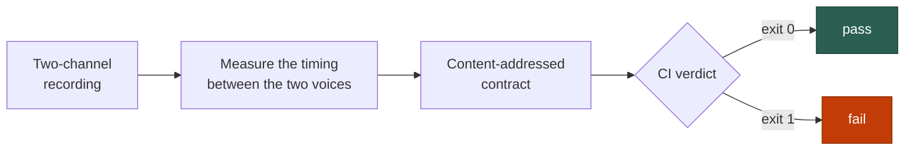
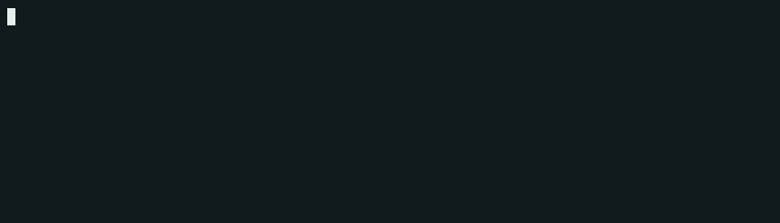

<div align="center">


<p>
<a href="https://pypi.org/project/hotato/"></a>
<a href="https://pypi.org/project/hotato/"></a>
<a href="https://pypi.org/project/hotato/"></a>
<a href="https://github.com/attenlabs/hotato/actions/workflows/tests.yml"></a>
<a href="LICENSE"></a>
<br>
<a href="docs/MCP.md"></a>

<a href="https://github.com/attenlabs/hotato/attestations"></a>
</p>

### The transcript passed. The call failed.

<p align="center">
<a href="#quickstart"><b>Quickstart</b></a> &#183;
<a href="#point-your-agent-at-it">Point an agent at it</a> &#183;
<a href="#how-it-works">How it works</a> &#183;
<a href="#five-dimensions-one-verdict">Five dimensions</a> &#183;
<a href="#wire-it-into-ci">CI gate</a> &#183;
<a href="#drive-it-over-mcp">MCP</a>
</p>

</div>

The transcript reads clean and passes. The call still failed. hotato is where that gap gets a test.

Your transcript tests are green. The call still went wrong. The agent talked over the caller, ran straight through the interruption, and took a beat too long to hand the floor back, and none of it is in the words. **hotato** gives that failure a number.

Give it a two-channel recording and it measures the timing between the two voices, then locks each catch into a CI contract.

## Key properties

- 📐 Conversation QA for voice agents: scores five dimensions (outcome, policy, conversation, speech, reliability) into one pass/fail verdict.
- ⏱️ Scores talk-over, ignored interruptions, and floor-yield latency, measured from two channels.
- 🔒 Each catch is a content-addressed contract that reproduces byte-for-byte across machines and releases.
- 🪶 Stdlib-only core: zero required dependencies, ~10 MiB installed, no network calls.
- 🤖 Reads [`AGENTS.md`](AGENTS.md); a coding agent runs the whole loop.
- 🌐 MIT-licensed, self-hosted, off the production audio path.

## Quickstart

Zero setup. Scores the bundled demo calls and prints each caught moment, credential-less.

```bash
uvx hotato start --demo                # scores bundled recorded calls, no account
```

That sweeps the two bundled demo calls, scores the timing between the voices, and exits `1` on the one where the agent ran through the caller.

Keep it in a project, or drive it over MCP on local stdio:

```bash
pipx install hotato                    # add it to your repo
uvx --from "hotato[mcp]" hotato-mcp    # drive it over MCP, local stdio
```

## Point your agent at it

Point Claude Code, Cursor, or any coding agent at this repo. It reads [`AGENTS.md`](AGENTS.md) and runs the loop itself: score the demo calls, ingest a recording, wire a CI gate, re-check the numbers. Every step is offline and needs no key.

```text
"Try hotato on the calls in ./recordings and add a CI gate that fails the build on a talk-over regression."
```

## Capabilities

<table>
<tr>
<td width="50%" valign="top">

⏱️ **Timing measurement**<br/>
Talk-over, ignored interruptions, and floor-yield latency, measured from the two channels.

</td>
<td width="50%" valign="top">

🎯 **Five scored dimensions**<br/>
Outcome, policy, conversation, speech, and reliability roll up into one pass/fail verdict.

</td>
</tr>
<tr>
<td width="50%" valign="top">

🔌 **Importers**<br/>
Ingest the call exports your stack already produces from Vapi, Retell, Twilio.

</td>
<td width="50%" valign="top">

🧪 **CI gate**<br/>
Drop the Action into a workflow; the step's exit code is hotato's verdict.

</td>
</tr>
<tr>
<td width="50%" valign="top">

🤖 **Agent surfaces**<br/>
An agent drives hotato from [`AGENTS.md`](AGENTS.md) and `hotato describe --format json`.

</td>
<td width="50%" valign="top">

🧩 **MCP-ready**<br/>
Score calls, verify contracts, and read verdicts over local stdio from any MCP client.

</td>
</tr>
<tr>
<td width="50%" valign="top">

🗂️ **Committable evidence**<br/>
Each catch saves as a contract bundle you commit, diff, and review with code.

</td>
<td width="50%" valign="top">

🛰️ **Self-hosted**<br/>
Credential-less; runs on the machine that invokes it.

</td>
</tr>
</table>

## How it works



A catch becomes a contract addressed by its own content, so the exact failure that shipped once reproduces on any machine that runs the suite. Same input, same verdict, every time.

## Five dimensions, one verdict

| Dimension | What it scores |
| :-- | :-- |
| 🎯 **Outcome** | Was the job done, judged on tool-call and state evidence. |
| 📋 **Policy** | Required disclosures and PII handling. |
| 💬 **Conversation** | Did the agent yield when the caller took the floor, and how fast. |
| 🗣️ **Speech** | Response latency and turn timing. |
| 📈 **Reliability** | `pass@1` / `pass@k` / `pass^k` with a Wilson interval. |

> **Two channels, one party each.** A mono or bad export is marked **NOT SCORABLE**, so a verdict measures timing, not intent.

## See a scored call

<p align="center">
<br/>
<sub>Scoring a real recorded call: the exact command and hotato's real scorecard.</sub>
</p>

## Specifications

| Property | Value |
| :-- | :-- |
| Footprint | ~10 MiB installed |
| Core dependencies | 0 (stdlib-only) |
| Reproducibility | byte-for-byte, content-addressed contract |
| Exit contract | `0` pass · `1` fail · `2` refuse |
| Release integrity | OIDC Trusted Publishing + build-provenance attested |
| Runtime | offline, off the production audio path |

## Wire it into CI

The step's exit code **is** hotato's exit code: `0` pass, `1` fail, `2` refuse. Drop the Action into a workflow and the build goes red on a regression:

```yaml
# .github/workflows/voice-qa.yml
name: voice qa
on: [pull_request]
permissions:
  contents: read          # read-only; runs fully offline
jobs:
  hotato:
    runs-on: ubuntu-latest
    steps:
      - uses: actions/checkout@v4
      - uses: attenlabs/hotato@v1.8.0
        with:
          contracts: contracts/          # the catches you committed
          hotato-version: 1.8.0          # exact pin, never a range
```

The catch you committed once now guards every pull request and reproduces the same verdict on the reviewer's machine.

<details>
<summary><b>Exit-code contract (gate on this, do not parse stdout)</b></summary>

<br>

| Exit | Meaning |
| :-: | :-- |
| `0` | every scorable event passed |
| `1` | a scorable event regressed |
| `2` | usage error or unusable input (bad flags, corrupt file, mono recording, or no scorable event) |

Copy-paste workflow with commit-SHA pin: [`docs/CI.md`](docs/CI.md) &#183; [`docs/CONTRACTS.md`](docs/CONTRACTS.md).

</details>

## Drive it over MCP

```bash
uvx --from "hotato[mcp]" hotato-mcp     # local stdio, no key
```

Point Claude Code, Cursor, or any MCP client at it to score calls, verify contracts, and read verdicts over the protocol. It exposes the `voice_eval_run` scorer plus read/verify/propose tools. Setup: [`docs/MCP.md`](docs/MCP.md).

## Verify the measurement yourself

<details>
<summary><b>Re-run the measurement benchmark</b></summary>

<br>

```bash
# re-run the measurement-error benchmark on the recorded AMI clips
PYTHONPATH=src python3 -m hotato.benchmark \
  --scenarios corpus/real/scenarios --audio corpus/real/audio
```

On 13 recorded AMI Meeting Corpus clips, the median error between measured caller-onset and the human word-alignment label is **20 ms**. Output: a per-signal error table and a yield/hold confusion matrix. Provenance (CC BY 4.0 source, sha256-pinned, human word alignments as ground truth) and caveats: [`corpus/real/README.md`](corpus/real). Method: [`METHODOLOGY.md`](METHODOLOGY.md).

</details>

<details>
<summary><b>Two channels, one party each</b></summary>

<br>

Timing between two voices is measurable only when they arrive on separate channels. A mono or mixed export can't be split back apart, so hotato marks it **NOT SCORABLE** and refuses. Check scorability first:

```bash
hotato trust --stereo call.wav        # per-channel activity, swap flag, scorability
```

It reads audio energy over time and surfaces candidate moments; a person labels each one yield (should have stopped) or hold (backchannel to talk through). It measures timing, not intent.

</details>

## Contribute

Issues and PRs are welcome. Start with [`CONTRIBUTING.md`](CONTRIBUTING.md), [`SECURITY.md`](SECURITY.md), and the [`CHANGELOG`](CHANGELOG.md).

**Docs:** [`AGENTS.md`](AGENTS.md) &#183; [`METHODOLOGY.md`](METHODOLOGY.md) &#183; [`docs/START.md`](docs/START.md) &#183; [`docs/CI.md`](docs/CI.md) &#183; [`docs/CONTRACTS.md`](docs/CONTRACTS.md) &#183; [`docs/MCP.md`](docs/MCP.md)

## License

MIT ([`LICENSE`](LICENSE))

mcp-name: io.github.attenlabs/hotato
