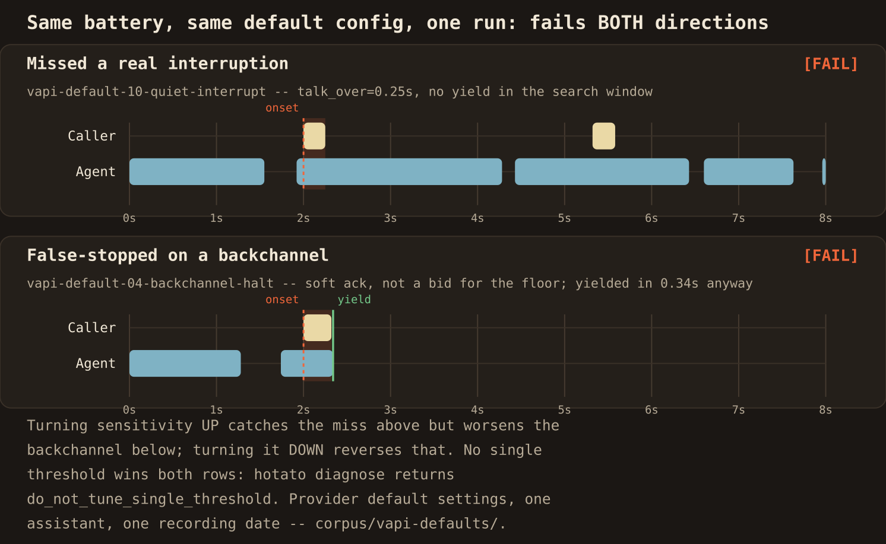

# corpus/vapi-defaults/ real calls against a voice agent on default interruption settings

`corpus/real/` proved the scorer on real human-human speech. This directory
is the other half of the story: real HUMAN-AGENT calls, scored end to end.
One human caller worked through 12 scripted turn-taking situations against a
live production voice agent whose interruption settings were left at the
vendor defaults, and hotato measured every scripted moment from the
dual-channel recordings. This is the set where the both-axes funnel fires on
real audio: the same default configuration misses a real interruption AND
false-stops on backchannels, in the same battery.

## Reproduce it

One command, from a fresh clone of this repository, re-scores the 15-scenario
battery, prints the both-directions-fail funnel, and prints the
`do_not_tune_single_threshold` verdict:

```bash
PYTHONPATH=src python3 -m hotato.cli run --suite barge-in \
  --scenarios corpus/vapi-defaults/scenarios --audio corpus/vapi-defaults/audio \
  --stack vapi --format json > /tmp/vapi-defaults-result.json; \
python3 -c "import json; d=json.load(open('/tmp/vapi-defaults-result.json')); print(json.dumps(d['funnel'], indent=2))"; \
PYTHONPATH=src python3 -m hotato.cli diagnose /tmp/vapi-defaults-result.json
```

Expect exit code 1 (six scenarios fail by design), the `funnel` object
(`reason` plus the engagement-control `pointer`), and a `diagnose` printout
ending in `battery decision: do_not_tune_single_threshold`. This is the exact
output pasted in `RESULTS.md`, reproduced live, not retyped.

The visual below is generated from the same scored envelope:
`PYTHONPATH=src python3 corpus/vapi-defaults/render_funnel.py` rebuilds
it from `corpus/vapi-defaults/scenarios/` and `audio/` via the repo's own
report-timeline renderer.



## Provenance

- Recorded 2026-07-06 by the repository operator (the caller is the
  operator's own voice; the agent is a synthetic TTS voice, so no third
  party appears in the audio).
- Agent: a Vapi assistant named `hotato-probe`
  (`37995a11-3b7e-41e7-87b5-198f08b6161a`), model openai/gpt-4o, voice
  vapi/Elliot, prompted to answer in long multi-sentence paragraphs.
- Interruption settings: Vapi DEFAULTS. `stopSpeakingPlan` and
  `startSpeakingPlan` were left unset. Nothing was tuned.
- Recording: Vapi's own `artifactPlan` dual-channel stereo at 44.1 kHz.
  Channel map: caller = channel 0, agent = channel 1 (verified empirically
  per call, head window vs full call RMS agree on all 12).
- The full recordings (about 109 MB) are not distributed with the
  repository. `manifest.json` pins their sha256 so the committed clips are
  verifiable end to end, and `build_vapi_defaults.py --data DIR --check`
  proves a rebuild is byte-identical.

## The 12 scripts

| # | script | the scripted moment |
|---|---|---|
| 1 | hard-interruption | loud cut-in mid-paragraph |
| 2 | one-word-stop | a single firm "Stop." mid-paragraph |
| 3 | backchannel-single | one soft "mhm" while the agent talks |
| 4 | backchannel-repeated | spaced soft backchannels (mhm / right / okay) |
| 5 | backchannel-then-real-interrupt | soft "yeah", then a loud "wait, actually, hold on" |
| 6 | double-talk | a sustained overlapping full sentence |
| 7 | correction | a mid-answer correction of the agent's assumption |
| 8 | rapid-turns | three interrupts in quick succession |
| 9 | long-mid-sentence-pause | a 4 s pause inside an unfinished question |
| 10 | quiet-interruption | a half-volume "sorry, one second" |
| 11 | silent-listen | the caller stays silent (baseline control) |
| 12 | immediate-overlap | barge-in over the greeting itself |

Scripts 1, 2, 6, 7, 10 and 12 label their moment `should_yield`; 3 and 4
label theirs `should_not_yield`; 5 carries one of each; 8 carries three
`should_yield` moments. Script 9 checks whether the agent stays out of a
mid-utterance pause (committed as an analysis clip, not a yield/hold
scenario), and script 11 is the no-event baseline (nothing to clip; the
full-call facts are in `manifest.json`).

## What the labels mean

The labels state what the SCRIPT calls for at each moment: a loud cut-in is
a genuine bid for the floor (`should_yield`), a soft "mhm" is an
acknowledgement, not a request to take over (`should_not_yield`). Hotato
does not decide any of that; it measures what the agent's audio actually did
around each labelled onset (`did_yield`, `seconds_to_yield`,
`talk_over_sec`) and compares it to the label. Onsets were derived from the
engine's own energy-VAD tracks: the scored moment of each call is the caller
activity that begins while the agent channel is active, matched to the
script notes; the per-clip reasoning is in `manifest.json` under
`onset_derivation`. Every `should_yield` scenario carries the same stated
bounds (`max_time_to_yield_sec` 1.0, `max_talk_over_sec` 1.0); nothing is
tuned per clip.

## Findings, as measured numbers

All from the committed clips at the scorer's default configuration; the
identical values measure on the full 44.1 kHz recordings (both are recorded
per clip in `manifest.json`, full detail and the two investigated
measurement-vs-field-note disagreements in `RESULTS.md`):

- The battery: 15 scenarios, 9 pass, 6 fail.
- Genuine loud interruptions were yielded to in 0.33 to 0.40 s (scripts 1,
  5, 6, 8, 12). The third rapid interrupt measured 0.00 s (the agent was
  already at a stop when the caller came in).
- The half-volume interrupt (script 10) produced NO yield inside the 3.0 s
  search window; the louder retry on the same call yielded in 0.60 s.
- Soft backchannels produced yields in 0.34 to 0.37 s three separate times
  (scripts 4 and 5): the agent stopped for "mhm"-class acknowledgements as
  fast as it stopped for real interruptions. After the second backchannel of
  script 4 the agent never spoke again for the remaining 24.6 s of the call.
- The single "Stop." (script 2) was followed by 1.26 s of continued agent
  speech, a sentence-end gap that hotato scores as a 1.46 s yield (FAIL
  against the 1.0 s bound), then a full restart of the paragraph 3.6 s
  after the command.
- The correction (script 7) was talked over for its entire 1.16 s, and the
  agent's next speech came 21.38 s after the caller finished, measured as
  `response_gap_sec` on the full call.
- The 4 s mid-sentence pause (script 9) was entered by the agent 3.44 s
  after the caller went quiet (`response_gap_sec` 3.44), inside the caller's
  unfinished sentence.
- The baseline call (script 11) contains zero caller onsets during agent
  activity and no overlap event.
- The battery envelope carries the both-axes funnel, and
  `hotato diagnose` on it returns battery decision
  `do_not_tune_single_threshold`: this one default configuration missed a
  real interruption (script 10) and false-stopped on backchannels (scripts
  4 and 5) in the same battery. Both verbatim outputs are pasted in
  `RESULTS.md`.

## Files

| file | what it is |
|---|---|
| `build_vapi_defaults.py` | Deterministic clip + label + manifest builder; `--check` byte-compares a rebuild. |
| `scenarios/*.json` | 15 battery labels (validate cleanly against `corpus/validate.py`, zero policy diffs). |
| `audio/*.example.wav` | 16 committed two-channel clips, 16 kHz 16-bit PCM (15 scenarios + the script 9 analysis clip), about 8.3 MB total. |
| `manifest.json` | Provenance, pinned source sha256s, per-clip onset derivation, and the measured numbers (clip and full call). |
| `battery-result.json` | The committed battery envelope (`run --suite ... --format json`), input to `diagnose`. |
| `render_funnel.py` | Rebuilds `both-directions-fail.svg`/`.png` from the committed scenarios and audio via the repo's own report-timeline renderer; no hand-drawn numbers. |
| `both-directions-fail.svg` / `.png` | The shareable visual: the missed-interruption and false-stop-on-backchannel timelines, from the real scored envelope. |
| `sample-report.html` | The battery report with the real call audio embedded (`report --embed-audio`). |
| `RESULTS.md` | The full results table, the two investigated disagreements, and the verbatim funnel + diagnose outputs. |

Run the battery yourself:

```bash
PYTHONPATH=src python3 -m hotato.cli run --suite barge-in \
  --scenarios corpus/vapi-defaults/scenarios --audio corpus/vapi-defaults/audio --stack vapi
```

Expect exit code 1: six scenarios fail, on both axes, and that is the
finding.

## Honest scope, read before citing

- These clips document ONE assistant, on ONE vendor's DEFAULT interruption
  settings, on ONE recording date, called by ONE cooperative scripted
  caller on a clean connection. They are a measured portrait of a default
  configuration, not a benchmark of a vendor, and they carry no accuracy
  percentage.
- The labels come from the caller's script (what a good agent should do at
  that moment), not from any model. Hotato contributes the timing
  measurements only.
- The committed clips are 44.1 kHz source windows linearly resampled to
  16 kHz for size. That is a documented processing step; the manifest
  records the measurement on both the clip and the original full recording,
  and they agree on every value for every clip.
- Two moments measure differently than the operator experienced them
  (scripts 2 and 3); `RESULTS.md` walks through the frame evidence for
  both instead of adjusting anything to match.
- Transcript fields in the labels quote the caller's SCRIPT, not an STT
  transcript of the audio.

## Licensing

The operator recorded these calls, owns the recordings, and releases the
committed clips and labels under the repository's MIT license (see
`LICENSE`). The caller's voice is the operator's own; the agent's voice is
synthetic. The calls follow a fictional-pharmacy script: no real names,
addresses, prescriptions, or identifiers are spoken, and no PHI exists. Each
label carries the full attestation block and validates cleanly against the
contribution policy in `corpus/validate.py`.
