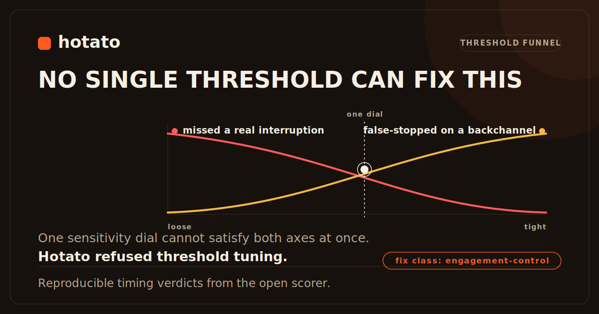
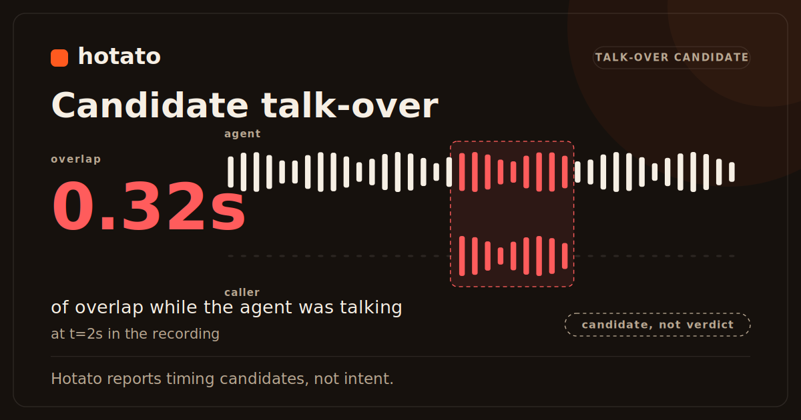
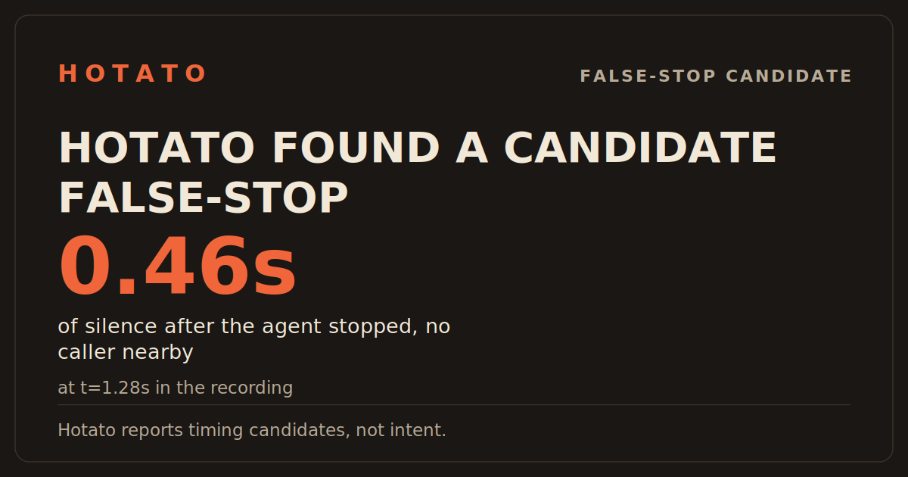

# Gallery

Every image and worked example Hotato ships, in one place, each one
reproducible with the command shown beside it.

## Cards: shareable findings

Three self-contained SVGs: offline, byte-stable from the same input, with every
font, image, and script inlined. Full spec: [CARDS.md](CARDS.md).

- 
  **The hero.** A battery where a missed interruption and a false stop fail
  together -- Hotato names the failure class (engagement-control) instead
  of picking one sensitivity dial.
  Regenerate: `hotato card fix-plan.json --out card.svg`
- 
  A measured talk-over moment: the agent kept the floor while the caller
  was speaking.
  Regenerate: `hotato card hotato-sweep.json#N --out card.svg`
- 
  A measured false-stop moment: the agent went quiet with no caller nearby
  to explain it.
  Regenerate: `hotato card hotato-sweep.json#N --out card.svg`

## The bundled demo, rendered

`hotato demo` writes a self-contained dashboard with embedded audio and a
hear-the-bug playhead. The report and the terminal walkthrough that produced
it:

- Report: [`assets/hotato-demo-report.png`](assets/hotato-demo-report.png) ·
  [`assets/hotato-demo-report.html`](assets/hotato-demo-report.html)
- Terminal walkthrough: [`assets/hotato-demo.gif`](assets/hotato-demo.gif)

## Trust gallery: eight input conditions, eight verdicts

The full worked set, with verbatim CLI output for every row of the
[trust matrix](TRUST-MATRIX.md), lives in [TRUST-GALLERY.md](TRUST-GALLERY.md).
Summary:

| # | Condition | Verdict |
|---|---|---|
| 1 | Clean dual-channel | Scores, full confidence |
| 2 | Silent caller channel | `NOT SCORABLE`, exit 2 |
| 3 | Silent agent channel | `NOT SCORABLE`, exit 2 |
| 4 | Swapped channels | Scores, with a swap warning |
| 5 | Crosstalk / echo bleed | Scores, at lower confidence |
| 6 | Mono (mixed channel) | `NOT SCORABLE` by default, exit 2; two opt-in escapes, both indicative only |
| 7 | Backchannel candidate | Surfaced as a candidate; you label it |
| 8 | Noisy false-positive candidate | Surfaced, with the reason it is likely spurious |

## Case studies

Recorded-audio write-ups, each following
[case-study-TEMPLATE.md](evidence/case-study-TEMPLATE.md) and each carrying a
mandatory "What Hotato did not prove" scope section:

- [`case-studies/vapi-01-hard-interruption.md`](case-studies/vapi-01-hard-interruption.md)

The full index and the launch target (3 external or semi-external studies, 5
consented fixtures, 1 before/after, 1 public PR) is in
[`case-studies/README.md`](case-studies/README.md), tracked against the gap in
[evidence/validation-plan.md](evidence/validation-plan.md).

## Where this fits

This page is the visual survey. For the standard behind what counts as evidence
and how it is ranked, see [EVIDENCE-PACK.md](EVIDENCE-PACK.md) and
[evidence/README.md](evidence/README.md).
